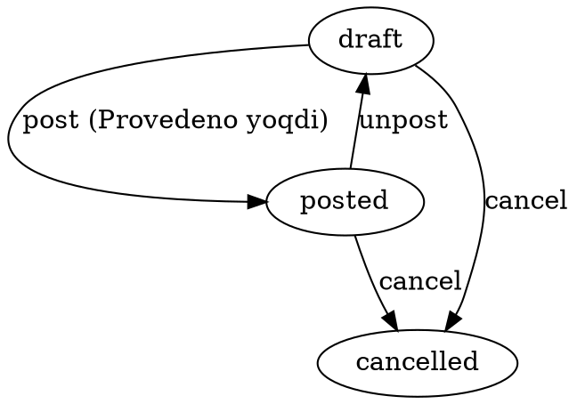

# Korrektirovka vzaimoraschetov — O'zaro hisob-kitob tuzatish

> Moysklad'ning «Корректировка взаиморасчётов» hujjatining 1:1 klon
> implementatsiyasi. Manual ravishda kontragentning balansini tuzatadi —
> schyot/to'lov/yuk hujjatisiz.

**Status**: ✅ Done · Sprint 9
**Code path**: `apps/api/src/modules/counterparty-adjustment` + `apps/web/src/app/(app)/counterparty-adjustments`
**DB model**: `CounterpartyAdjustment` (`packages/db/prisma/schema.prisma:2351`)
**Test count**: 10 unit (service)

---

## 1. Bu nima?

Kontragent bilan «o'zaro hisob» (vzaimoraschet) bizning ERP'da pul
hujjatlari (schyot, to'lov, yuk berish, kelish) orqali avtomat
yangilanadi. Lekin ba'zan **boshqa yo'l yo'q** holatlar bo'ladi —
o'shanda klerk **qog'oz iz qoldirib**, balansni qo'lda nudge qilishi
kerak. Aynan shu narsa **«Tuzatish»** (Korrektirovka).

**Texnik ta'rif**: bu hujjat ikki narsa qiladi:

1. `counterparty_adjustments` jadvaliga qator yozadi (paper trail) —
   audit, soliq, va keyingi savol-javob uchun.
2. `Provedeno` qilingan paytda `counterparty_balances.balance_minor`
   ustunini `+sumMinor` (INCREASE) yoki `−sumMinor` (DECREASE) qiladi.

`/reports/counterparty-balance` hisoboti to'g'ridan-to'g'ri
`counterparty_balances` jadvalini ko'rsatadi, shuning uchun tuzatish
**darhol** hisobotga aks etadi — kechikish yo'q.

---

## 2. Qachon ishlatamiz?

### Senariy A — mijoz «eski qarz» da'vo qiladi

Mijoz kelib: *"Men sizga 2024-yili 500 ming qarz qolib edim, ro'yxatga olmagansiz"* deydi.

Bizning bazada bunday yozuv yo'q — chunki o'sha vaqtdagi to'lov hujjati yo'q.
Variantlar:

| Yo'l | Muammo |
|------|--------|
| Eski to'lov hujjatini yozish (backdated) | Bank vypiskasi bilan mos kelmaydi — audit'ga muammo |
| Yangi schyot yozib darhol to'lov qilish | Asossiz: tovar yo'q edi |
| **Korrektirovka INCREASE** ✅ | Sof: «ushbu sanada eski qarz aniqlandi, +500 ming» |

Hujjat nomi: `KV-2026-00001`, yo'nalish: **Qarz oshirish (+)**, summa: 500 000 × 100 = 50 000 000 minor.

### Senariy B — okruglenie qoldig'i

Mijoz schyot bo'yicha 1 234 567 to'ladi, bizning hisobimizda 1 234 568 chiqdi
(rate bo'yicha 1 tiyin farq). Bu **shartnoma bo'yicha** mijozga qaytarib bera olmaymiz
va talab ham qilmaymiz. Klerk:

- Korrektirovka **DECREASE**, summa: 1 tiyin (= 1 minor)
- Izoh: «округление по договору»

Natija: balans nol bo'lib qoladi, hisobot toza.

### Senariy C — boshqa tizimdan migratsiya

Sizning kompaniyangiz 1C'dan moysklad'ga ko'chdi. Migratsiya skriptida har
kontragent uchun **opening balance** yaratish kerak — lekin 1C'dagi har bir
schyot/to'lov tarixini ko'chirib o'tirmaslik uchun.

- Har kontragent uchun bitta `INCREASE` (qarzdor bo'lganlar) yoki bitta `DECREASE` (biz qarzdor) korrektirovkasi
- `externalCode` = 1C'dagi original document ID (audit izi uchun)
- `description` = «Импорт начального остатка на 2026-01-01»

Migratsiya keyin ham xato yuz bersa, `externalCode` orqali tezda izlanadi.

### Senariy D — debt write-off (списание безнадёжной задолженности)

Mijoz 6 oydan beri to'lamayapti, sudga bermoqchi emassiz, hisobot toza turishi kerak.

- **DECREASE** korrektirovka, summa = mijozning qarzdorligi
- Izoh: «Списание безнадёжной задолженности, реш. №…»
- Soliq tomondan bu xarajat sifatida hisoblanadi (UZ Soliq Kodeksi 304-modda)

---

## 3. Qayerda chiqadi?

### Asosiy joylar

1. **Sub-nav**: `Pul → O'zaro hisob-kitob tuzatish` (yangi tab)
   — Url: `/counterparty-adjustments`

2. **Kontragent karta**: `CRM → Kontragentlar → [Mijoz] → Hujjatlar` —
   shu yerda mijozga tegishli barcha tuzatishlar ko'rinadi (ish boshqa
   doc'lar bilan).

3. **Hisobot**: `Hisobotlar → Kontragentlar balansi
   (/reports/counterparty-balance)` — bu yerda tuzatish darhol balansda
   aks etadi (Provedeno qilingan bo'lsa). Balansning «sabab»ini
   ko'rmoqchi bo'lsa, hisobotdan har kontragent ostidagi hujjatlar
   ro'yxatiga drilldown qiladi.

### List ko'rinishi (`/counterparty-adjustments`)

Ustunlar (chap → o'ng):

| # | Ustun | Misol qiymat |
|---|-------|--------------|
| 1 | № | KV-2026-00001 |
| 2 | Sana | 11.05.2026 |
| 3 | Kontragent | ABC MCHJ |
| 4 | Yo'nalish | Qarz oshirish / Qarz kamaytirish |
| 5 | Izoh | "Eski qarz aniqlandi" |
| 6 | Holat | Qoralama / Provedeno / Bekor qilindi |
| 7 | Summa | **+500 000 UZS** yoki **−1 UZS** (rang bilan) |

Filter pillalar: All / Qoralama / Provedeno / Bekor qilindi. Click-to-sort
har «sortable» ustunda ishlaydi.

### `/new` ko'rinishi

To'liq moysklad-parity layout: **DocumentEditor + DocumentHeader + DocumentMetaPanel + Tabs**.

Maydonlar (majburiy ⭐):
- ⭐ Контрагент (CatalogPicker bilan)
- ⭐ Организация (CatalogPicker — default = birinchi tashkilot)
- ⭐ Направление — radio: «Qarz oshirish» yoki «Qarz kamaytirish»
- ⭐ Сумма (BigInt minor, masalan 50000000 = 500 000 UZS)
- Валюта (default UZS)
- Внешний код
- Комментарий (4096 belgigacha)

Provedeno toggle hujjat saqlanganda balansga ta'sir qiladi.

### `/[id]` ko'rinishi

Detail/edit forma. Locking rule: **Provedeno bo'lsa, hech qaysi maydonni
o'zgartira olmaysiz**. Avval Provedeno toggle'ni o'chiring (unpost) —
balans avtomat qaytariladi.

Tablar:
- **Yo'nalish** (positions tab o'rnida — summary card)
- **Связанные документы** — bog'liq hujjatlar (kelajakda)
- **Файлы** — fayllar (CounterpartyAdjustment entityga biriktiriladi)
- **История изменений** — audit timeline

---

## 4. Holat mashinasi (FSM)



**Balans ta'sir** (har tranzitsiyada):

| Tranzitsiya | applyDelta chaqiriladi? | Delta belgisi |
|-------------|-------------------------|---------------|
| `post` (INCREASE) | ha | `+sumMinor` |
| `post` (DECREASE) | ha | `−sumMinor` |
| `unpost` (INCREASE) | ha | `−sumMinor` (qaytarish) |
| `unpost` (DECREASE) | ha | `+sumMinor` (qaytarish) |
| `cancel` from draft | yo'q | — (balans hech qachon tegmagan) |
| `cancel` from posted | ha | qarama-qarshi belgi (qaytarish) |
| `delete` from draft | yo'q | — |
| `delete` from posted | ha | qarama-qarshi belgi |

Idempotensiya: agar `applicable === true` bo'lsa, `post()` `BadRequestException` qaytaradi (ikki marta post qilolmaysiz).

---

## 5. Boshqa hujjatlar bilan bog'liqlik

### Counterparty balance (`/reports/counterparty-balance`)

Bu hisobot `counterparty_balances` jadvalining materialize ko'rinishini
chiqaradi. Korrektirovka **provedeno** bo'lgan zahoti balans darhol
yangilanadi (`CounterpartyBalanceService.applyDelta` chaqiriladi).

**Sign konvensiyasi** (moysklad bilan bir xil):
- `+ balance` → kontragent bizga qarzdor
- `− balance` → biz kontragent oldida qarzdormiz

### Boshqa pul hujjatlari bilan o'zaro ta'sir

| Hujjat | Default delta belgisi |
|--------|----------------------|
| InvoiceOut.post | +sumMinor (biz schyot berdik) |
| InvoiceIn.post | −sumMinor (ular schyot berdi) |
| PaymentIn.post | −sumMinor (mijoz to'ladi) |
| PaymentOut.post | +sumMinor (biz to'ladik) |
| CashIn.post | −sumMinor |
| CashOut.post | +sumMinor |
| **CounterpartyAdjustment INCREASE.post** | **+sumMinor** |
| **CounterpartyAdjustment DECREASE.post** | **−sumMinor** |

Yangi tuzatish boshqa pul hujjatlari bilan **bir xil mexanizm orqali**
balansga ta'sir qiladi — alohida pipeline yo'q. Bu xato ehtimolini
kamaytiradi.

---

## 6. API endpointlar

```
GET    /api/v1/counterparty-adjustments         # ro'yxat + filter
GET    /api/v1/counterparty-adjustments/:id     # bitta hujjat
POST   /api/v1/counterparty-adjustments         # yaratish
PATCH  /api/v1/counterparty-adjustments/:id     # tahrirlash (draft only)
DELETE /api/v1/counterparty-adjustments/:id     # soft delete
POST   /api/v1/counterparty-adjustments/:id/clone           # nusxa olish
POST   /api/v1/counterparty-adjustments/:id/transitions/post    # provedeno qilish
POST   /api/v1/counterparty-adjustments/:id/transitions/unpost  # qaytarish
POST   /api/v1/counterparty-adjustments/:id/transitions/cancel  # bekor qilish
```

**Permissions** (`counterpartyadjustment` entity):
- `view` — list + detail
- `create` — POST + clone
- `update` — PATCH (draft only)
- `delete` — DELETE
- `approve` — transitions

### Yaratish (POST) namunasi

```json
{
  "agentId": "00000000-0000-0000-0001-000000000001",
  "organizationId": "00000000-0000-0000-0000-000000000010",
  "direction": "INCREASE",
  "sumMinor": "50000000",
  "currency": "UZS",
  "description": "Eski qarz aniqlandi, 2024-yil",
  "externalCode": "1C-DOC-12345",
  "moment": "2026-05-11T10:00:00",
  "applicable": false
}
```

Response: `{ "id": "...", "name": "KV-2026-00001", "state": "draft", ... }`

`name` avtomatik generatsiya qilinadi (`KV-YYYY-NNNNN`).

---

## 7. Kelajakda

- [ ] Bog'liq hujjatlar grafigi (kontragent uchun barcha balans yurit hujjatlar bir vizualizatsiyada)
- [ ] Bulk import — Excel orqali (migratsiya senariysi C uchun)
- [ ] Print template — qog'ozli «Akt сверки» bilan birga chiqarish uchun
- [ ] EDO integratsiyasi — soliq tomonga ko'rsatish kerak bo'lsa
- [ ] Approval flow — yuqori summalar uchun director imzosi talab qilinishi

---

**Tegishli kod**:
- Backend: `apps/api/src/modules/counterparty-adjustment/`
- Frontend: `apps/web/src/app/(app)/counterparty-adjustments/`
- i18n: `apps/web/src/messages/{uz,ru}.json` — `pages.counterparty_adjustment`, `states.counterparty_adjustment`, `nav.money.counterparty_adjustments`
- Permissions: `apps/api/src/modules/permissions/permissions.types.ts:64` (`counterpartyadjustment`)
- DB model: `packages/db/prisma/schema.prisma:2351`
