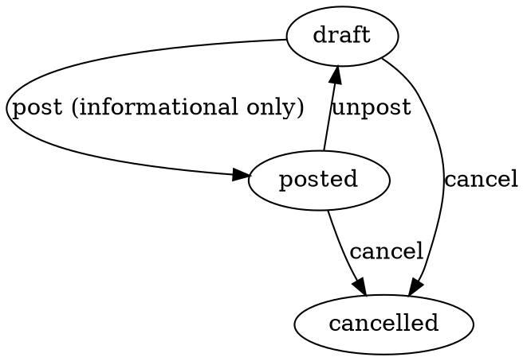

# InternalOrder — Ichki buyurtma

> Omborlar (yoki bo'limlar) orasidagi stock harakatlanish so'rovi. Moysklad'ning
> «Внутренний заказ» hujjatining 1:1 klon implementatsiyasi.

**Status**: ✅ Done · Sprint 9
**Code path**: `apps/api/src/modules/internal-order` + `apps/web/src/app/(app)/internal-orders`
**DB model**: `InternalOrder` + `InternalOrderPosition` (`packages/db/prisma/schema.prisma:2297`)
**Test count**: 11 unit (service)

---

## 1. Bu nima?

Bir ombor (yoki bo'lim) boshqa **ichki** ombordan mahsulot olishi kerak.
Lekin to'lov yo'q (bu kompaniya ichida), schyot ham yo'q. Faqat
«rejalashtirilgan ko'chirish» kerak.

**Ichki buyurtma** (Внутренний заказ) — bu shu so'rovning paper trail'i:

1. Bir ombor (yoki bo'lim) "menga 20 ta iPhone kerak" deydi
2. InternalOrder yaratiladi (`storeId` = qabul qiluvchi ombor)
3. Provedeno qilinsa — rejaga olinadi
4. Keyinroq **Move** hujjati yoziladi (bu InternalOrderga bog'lanishi mumkin)
5. Move bajarilganda `movedQuantity` har pozitsiyada oshib boradi
6. Buyurtma to'liq bajarilsa, state `posted` da qoladi (audit izi)

**Muhim**: InternalOrder **stock balansiga ta'sir qilmaydi** — u faqat
hujjat. Real stock o'zgarishi Move hujjati post bo'lganda sodir bo'ladi.

---

## 2. Qachon ishlatamiz?

### Senariy A — Filialdan markazga so'rov

Toshkent markaziy omborida 100 ta iPhone bor. Samarqand filialida 0.
Filial menejeri:

- InternalOrder yaratadi
- `storeId` = Samarqand filial ombori (maqsad)
- Pozitsiya: 20 ta iPhone 15 Pro Max
- Yetkazib berish sanasi: 3 kun keyin
- Izoh: "Sotuv kerak, retail uchun"

Markaziy omborning menejeri buyurtmani ko'radi, **Move** hujjati yaratadi
(InternalOrder'ga bog'lab) va yuborib qo'yadi.

### Senariy B — Production uchun materiallar

Ishlab chiqarish bo'limi xom-ashyo so'raydi:

- InternalOrder: "100 kg po'lat, 50 kg alyuminiy"
- `storeId` = Sex ombori
- Provedeno → Move bilan po'lat asosiy ombordan sexga ko'chiriladi

### Senariy C — Tovarlarni magaza tarqatish

Markaziy ombor → 5 ta magaza. Har magaza uchun alohida InternalOrder:

- Magaza 1: 50 ta tovar (turli SKU lar)
- Magaza 2: 30 ta tovar
- ...

Bu menejerga **kim qancha kerak** ekanligini ko'rsatadi va Move
hujjatlarini avtomat planlash imkonini beradi.

### Senariy D — Inventarizatsiyadan keyin balanslash

Inventarizatsiya `Surplus` (ortiqcha) yoki `Shortage` (yetishmovchilik)
ko'rsatdi. Bir omborda ortiqcha, boshqasida yetishmovchilik bor —
InternalOrder yaratib balanslash mumkin.

---

## 3. Qayerda chiqadi?

### Asosiy joylar

1. **Sub-nav**: `Ombor → Ichki buyurtma`
   — URL: `/internal-orders` (Peremeshcheniya tabidan keyin)

2. **Store karta**: `Sozlamalar → Omborlar → [ombor]` — kelajakda ombor
   uchun pending InternalOrderlar ko'rinishi mumkin (Sprint 10+)

3. **Move hujjati [id] sahifasi**: kelajakda Move InternalOrder'ga bog'lash imkoniyatini ochadi

### List ko'rinishi (`/internal-orders`)

Ustunlar:

| # | Ustun | Misol |
|---|-------|-------|
| 1 | № | IO-2026-00001 |
| 2 | Sana | 12.05.2026 |
| 3 | Yetkazib berish sanasi | 15.05.2026 |
| 4 | Maqsad ombor | Samarqand filial |
| 5 | Pozitsiyalar soni | 20 |
| 6 | Holat | Provedeno |
| 7 | Summa | 30 000 000 UZS (informational) |

Filter pillalar: All / Qoralama / Provedeno / Bekor qilindi.

### `/new` ko'rinishi

- Organization + Store (maqsad ombor) pickerlari
- Yetkazib berish sanasi (date-only)
- PositionTable: index, mahsulot, miqdor, narx (ixtiyoriy), summa
- PositionInlineAdd: inline mahsulot qidirish + tanlash
- DocumentTotalsPanel: jami summa va NDS

**Muhim**: kamida 1 ta pozitsiya talab qilinadi (Zod schema enforced).

### `/[id]` ko'rinishi

- Provedeno qilinganda barcha maydonlar lock
- Pozitsiyalarda **«Bajarilgan»** progress ustuni:
  - movedQuantity/quantity — yashil agar to'liq bajarilgan
- Clone qilish mumkin (yangi draft yaratiladi, pozitsiyalar nusxalanadi)
- Soft delete faqat draft hujjat uchun (posted → avval unpost yoki cancel)

---

## 4. Holat mashinasi (FSM)



| Tranzitsiya | Stock ta'sir | Balance ta'sir |
|-------------|--------------|----------------|
| post | yo'q | yo'q |
| unpost | yo'q | yo'q |
| cancel | yo'q | yo'q |

InternalOrder **hech qachon stockga yoki balansga ta'sir qilmaydi**.
Faqat planning + audit izi.

Real stock o'zgarishi **Move** hujjati orqali bo'ladi (bu hujjat
InternalOrder'ga bog'lanishi mumkin, keyingi sprintlarda).

---

## 5. Boshqa hujjatlar bilan bog'liqlik

### Move (Peremeshcheniya)

Hozircha bog'lanish to'g'ridan to'g'ri yo'q, lekin keyingi sprintda:
- Move `internalOrderId` foreign key olishi mumkin (DB allows)
- Move posted bo'lganda `InternalOrderPosition.movedQuantity` oshadi
- `InternalOrder.movedSumMinor` aggregate

### Inventory

Inventarizatsiyadan keyin "noaniq" omborlar uchun InternalOrder yaratish
mumkin (Senariy D).

### CustomerOrder

Mijoz buyurtmasi kelganda, agar kerakli mahsulot boshqa omborda bo'lsa,
avtomat InternalOrder yaratish (kelajakda).

---

## 6. Position'lar (line items)

Har pozitsiya:
- `assortmentKind`: product / variant / bundle
- `assortmentId`: tegishli ID
- `productId`: product bo'lsa mirroring (boshqa kind'lar uchun null)
- `quantity`: Decimal(20,6) — minimum 0.000001
- `movedQuantity`: 0 dan boshlanadi, Move hujjati posted bo'lganda oshadi
- `priceMinor`: ixtiyoriy (reporting only, balans hisobi yo'q)
- `vat`: foiz (ixtiyoriy)
- `vatEnabled`: boolean

Update'da pozitsiyalar **replace-all** semantikasi: PATCH body'da
`positions[]` qaytadan butun array yuboriladi (delete + recreate). Agar
`positions` omited bo'lsa, mavjudlari tegmaydi.

---

## 7. API endpointlar

```
GET    /api/v1/internal-orders         # ro'yxat
GET    /api/v1/internal-orders/:id     # bitta, positions[] bilan
POST   /api/v1/internal-orders         # yaratish (positions majburiy, min 1)
PATCH  /api/v1/internal-orders/:id     # tahrirlash (draft only)
DELETE /api/v1/internal-orders/:id     # soft delete (draft only)
POST   /api/v1/internal-orders/:id/clone
POST   /api/v1/internal-orders/:id/transitions/:target  # post|unpost|cancel
```

**Permissions** (`internalorder`):
- view, create, update, delete, approve

### Yaratish (POST) namunasi

```json
{
  "organizationId": "00000000-0000-0000-0000-000000000010",
  "storeId": "00000000-0000-0000-0000-000000000020",
  "deliveryPlannedMoment": "2026-05-15",
  "description": "Filial uchun retail stock",
  "applicable": false,
  "positions": [
    {
      "assortmentKind": "product",
      "assortmentId": "00000000-0000-0000-0000-000000000100",
      "quantity": "20",
      "priceMinor": "1500000000",
      "vat": 12,
      "vatEnabled": true
    },
    {
      "assortmentKind": "product",
      "assortmentId": "00000000-0000-0000-0000-000000000101",
      "quantity": "10",
      "priceMinor": "500000000",
      "vatEnabled": true
    }
  ]
}
```

Response: `{ id, name: "IO-2026-00001", state: "draft", sumMinor: "35000000000", ... }`

---

## 8. Kelajakda

- [ ] Move hujjatini InternalOrder'ga bog'lash (`Move.internalOrderId` migration)
- [ ] Auto-fulfilment progress hisobi (Move posted → InternalOrderPosition.movedQuantity)
- [ ] Buyurtma to'liq bajarilganda visual «✓ Fulfilled» badge
- [ ] Stock availability check yaratishda — agar buyurtma summasi mavjud stockdan ortiq bo'lsa ogohlantirish
- [ ] Bulk InternalOrder yaratish — CustomerOrder'larga avtomat reaksiya
- [ ] CSV/Excel import yangi katta buyurtmalar uchun

---

**Tegishli kod**:
- Backend: `apps/api/src/modules/internal-order/`
- Frontend: `apps/web/src/app/(app)/internal-orders/`
- i18n: `pages.internal_order`, `states.internal_order`, `nav.stock.internal_orders`
- Permissions: `apps/api/src/modules/permissions/permissions.types.ts` (`internalorder`)
- DB models: `packages/db/prisma/schema.prisma` — InternalOrder (2297), InternalOrderPosition (2356)
- Migration: `packages/db/prisma/migrations/20260512080035_add_internal_order_position/`
