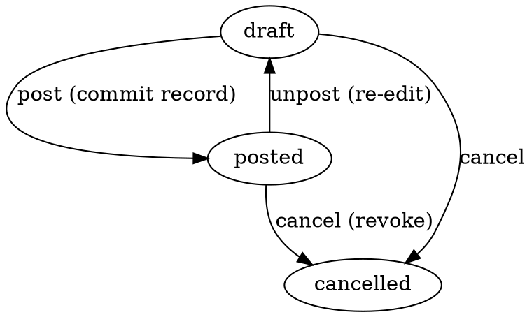

# Payroll — Ish haqi (Зарплата)

> Bir xodim, bir period uchun ish haqi hisobi. Moysklad'ning «Зарплата»
> hujjatining 1:1 klon implementatsiyasi. UZ HR ehtiyojlari uchun
> moslashtirilgan (NDFL, ijtimoiy fond, avans liniyalari).

**Status**: ✅ Done · Sprint 9
**Code path**: `apps/api/src/modules/payroll` + `apps/web/src/app/(app)/payrolls`
**DB model**: `Payroll` + `PayrollLine` (`packages/db/prisma/schema.prisma`)
**Test count**: 20 unit (service)

---

## 1. Bu nima?

Har xodim uchun har oy (yoki har qaysi period uchun) ish haqi hujjati
yaratiladi. Hujjat **3 ta narsani** birlashtiradi:

1. **Hisob-kitob** (calculation): oylik + mukofotlar − ushlanmalar = sof to'lov
2. **Rasmiy yozuv** (audit record): kim, qancha, qachon, qaysi davr uchun
3. **Tarix** (history): kelajakda audit/soliq tekshiruvi uchun

**Payment yo'q** — Payroll faqat **hisob qiladi**. Real pul transferi alohida
`CashOut` (yoki bank to'lov) hujjati orqali amalga oshiriladi. Bu split
moysklad'ning real-world business pattern'i:
- HR Payroll tayyorlaydi (xodim oylik + mukofot, kim qancha)
- Buxgalter to'lovni amalga oshiradi (CashOut/Bank PaymentOut)
- Ikkalasi alohida hujjat — har biri o'ziga xos audit izi

---

## 2. Qachon ishlatamiz?

### Senariy A — Oddiy oylik hisobi

Direktor: "Mayda oylik hisoblang"

HR:
- Har xodim uchun bitta Payroll yaratadi (yoki bulk operation orqali)
- Lines:
  - Asosiy oylik: +5 000 000 (positive — earning)
  - Premiya: +500 000 (positive — earning)
  - Daromad solig'i 12%: −660 000 (negative — deduction)
  - Ijtimoiy fond 1%: −55 000 (negative — deduction)
  - **Sof to'lov: 4 785 000 UZS** (derived header sumMinor)
- Provedeno qiladi → rasmiy hujjat

Buxgalter:
- Har Payroll uchun CashOut yaratadi (yoki "Yaratish → Naqd to'lov" tugmasini bosadi)
- CashOut'ning agent'i = xodim, summa = sof to'lov
- CashOut post → ish haqi mijozga (xodimga) o'tdi

### Senariy B — Avans + asosiy to'lov

Oyning yarmida xodim avans olgan (500 000):
- Birinchi CashOut: −500 000 yoy avans sifatida amalga oshirilgan

Oy oxirida Payroll:
- Asosiy oylik: +5 000 000
- Avans: −500 000 (allaqachon olingan)
- Solliqlar: −660 000
- **Sof to'lov: 3 840 000 UZS**

Buxgalter ikkinchi CashOut'ni shu summa bilan amalga oshiradi.

### Senariy C — Jarima (penalty)

Xodim ish vaqtida xatolik qildi:
- Asosiy oylik: +5 000 000
- Jarima: −200 000
- Solliqlar: −660 000
- **Sof to'lov: 4 140 000 UZS**

### Senariy D — Soliq audit

Soliq tekshirsa: "Bu xodimga 2026-yil may oyida qancha to'ladingiz?"

- `/payrolls?employeeId=X&periodFrom=2026-05-01&periodTo=2026-05-31`
- Payroll'ni topib detail sahifaga kiriasiz
- Lines'da har detalga ko'rinadi: oylik, mukofot, soliqlar, ushlanmalar
- "Bog'liq hujjatlar" tabida CashOut'ga drilldown qilamiz (manual link
  via description — kelajakda strong FK qo'shilishi mumkin)

---

## 3. Qayerda chiqadi?

### Asosiy joylar

1. **Sub-nav**: `Pul → Ish haqi` (Korrektirovka tabidan keyin)
   — URL: `/payrolls`

2. **Xodim karta**: `Xodimlar → [Xodim]` — kelajakda shu xodim uchun
   barcha Payroll hujjatlari ro'yxati

3. **Hisobotlar**: kelajakda payroll P&L tab — har oy jami ish haqi xarajati

### List ko'rinishi

| # | Ustun | Misol |
|---|-------|-------|
| 1 | № | Z-2026-00001 |
| 2 | Sana | 12.05.2026 |
| 3 | Davr | 01.05.2026 — 31.05.2026 |
| 4 | Xodim | Admin User · Administrator |
| 5 | Satrlar | 4 |
| 6 | Holat | Provedeno |
| 7 | Sof to'lov | 4 785 000.00 UZS |

### `/new` ko'rinishi

- Organization + Employee picker
- Period: start + end (default = joriy oy boshi/oxiri)
- **Inline lines editor**:
  - Type dropdown (Asosiy oylik / Mukofot / NDFL / ...)
  - Description input
  - Summa input (unsigned — sign avtomat type'ga qarab qo'yiladi)
  - Footer: Earnings / Deductions / **Net** live counters
- Comment textarea

### `/[id]` ko'rinishi

- Provedeno bo'lganda barcha maydonlar lock
- Lines'ni inline tahrirlash mumkin (draft holatda)
- Cancel tugmasi → state=cancelled
- "Yaratish → Naqd to'lov (CashOut)" → CashOut /new'ga o'tadi description'da Payroll № va xodim nomi bilan

---

## 4. Line types (turli ko'rsatkichlar)

| Type kod | Display (uz) | Display (ru) | Sign |
|----------|--------------|--------------|------|
| salary | Asosiy oylik | Оклад | + |
| bonus | Mukofot | Премия | + |
| overtime | Qo'shimcha ish | Сверхурочные | + |
| vacation | Ta'til to'lovi | Отпускные | + |
| sick | Kasallik varaqasi | Больничный | + |
| tax_income | Daromad solig'i | НДФЛ | − |
| tax_social | Ijtimoiy fond | Соц. фонд | − |
| advance | Avans | Аванс | − |
| penalty | Jarima | Штраф | − |
| other | Boshqa | Прочее | + |

Type kod free-form string sifatida saqlanadi — UI listdagi default'larni
ko'rsatadi, lekin custom string (`bonus_yearend`, `meal_allowance`) ham
saqlanadi (display'da raw string sifatida ko'rinadi).

**Sign rule**: deduction type'lar (tax_income, tax_social, advance,
penalty) avtomat negative bo'ladi. Boshqa typlar positive. Klerk
unsigned summa kiritadi, UI sign'ni type'ga qarab qo'yadi.

---

## 5. Holat mashinasi (FSM)



**Stock yoki balance ta'sir YO'Q** — bu pure record-keeping doc.

Kelajakda: post yoki cancel CashOut'ga avtomat ta'sir qilishi mumkin
(Payment integration sprint).

---

## 6. Math model

**Header sumMinor** = SUM(line.sumMinor signed)

Backend (`service.computeSum`) inline lines'ni signed-summasi sifatida
qo'shadi:
- earning lines → positive contribution
- deduction lines → negative contribution
- **header.sumMinor = net** (musbat = mijozga to'lash kerak, manfiy =
  mijozdan ushlash kerak — odatda 0 ga yaqin yoki negative qoladi
  bonusdan ortiq jarima/avans bo'lsa)

BigInt arithmetic — tiyin precision. Float yo'q, rounding yo'q.

UI lines'ni unsigned olib, type'ga qarab sign'ni qo'yadi. Submit'da
backend qaytadan signed strings'ni qabul qiladi va o'zi `computeSum`'ni
ishga tushiradi (UI total bu faqat preview).

---

## 7. API endpointlar

```
GET    /api/v1/payrolls         # ro'yxat
GET    /api/v1/payrolls/:id     # bitta, lines bilan
POST   /api/v1/payrolls         # yaratish (lines majburiy, min 1)
PATCH  /api/v1/payrolls/:id     # tahrirlash (draft only, lines replace-all)
DELETE /api/v1/payrolls/:id     # soft delete (draft only)
POST   /api/v1/payrolls/:id/clone
POST   /api/v1/payrolls/:id/transitions/:target  # post|unpost|cancel
```

**Permissions** (`payroll`):
- view, create, update, delete, approve

### Yaratish (POST) namunasi

```json
{
  "organizationId": "00000000-0000-0000-0000-000000000010",
  "employeeId": "00000000-0000-0000-0000-000000000050",
  "periodStart": "2026-05-01",
  "periodEnd": "2026-05-31",
  "applicable": false,
  "description": "May 2026 oylik",
  "lines": [
    { "itemType": "salary", "itemName": "Asosiy oylik", "sumMinor": "500000000" },
    { "itemType": "bonus", "itemName": "Quartal mukofoti", "sumMinor": "50000000" },
    { "itemType": "tax_income", "itemName": "NDFL 12%", "sumMinor": "-66000000" },
    { "itemType": "tax_social", "itemName": "Ijtimoiy fond 1%", "sumMinor": "-5500000" }
  ]
}
```

Response: `{ id, name: "Z-2026-00001", sumMinor: "478500000", lines: [...] }`

---

## 8. Test coverage

20 unit test (adversarial QA):

- ✅ Sum computation — signed lines sum to net header
- ✅ All-negative payroll (e.g. retroactive deduction)
- ✅ Empty lines array rejected
- ✅ Period validation (start ≤ end) — on create + on partial update
- ✅ Post-on-create stamps postedAt
- ✅ Lines persisted via createMany
- ✅ Update blocked on posted
- ✅ Update replace-all + sum recompute
- ✅ Update empty lines rejected
- ✅ FSM: post requires draft + lines, rejects already-posted
- ✅ FSM: unpost requires posted, clears postedAt
- ✅ FSM: cancel from any non-cancelled state
- ✅ Cancel rejects already-cancelled
- ✅ Invalid transition target rejected
- ✅ softDelete rejects posted
- ✅ softDelete on draft stamps deletedAt + cancelled
- ✅ findById excludes soft-deleted

---

**Tegishli kod**:
- Backend: `apps/api/src/modules/payroll/`
- Frontend: `apps/web/src/app/(app)/payrolls/`
- i18n: `pages.payroll`, `states.payroll`, `nav.money.payrolls`
- Permissions: `apps/api/src/modules/permissions/permissions.types.ts` (`payroll`)
- DB models: `packages/db/prisma/schema.prisma` — Payroll + PayrollLine
- Migration: `20260512104723_add_payroll`
- Related: Employee (FK), Organization (FK), CashOut (manual link via description for now)
