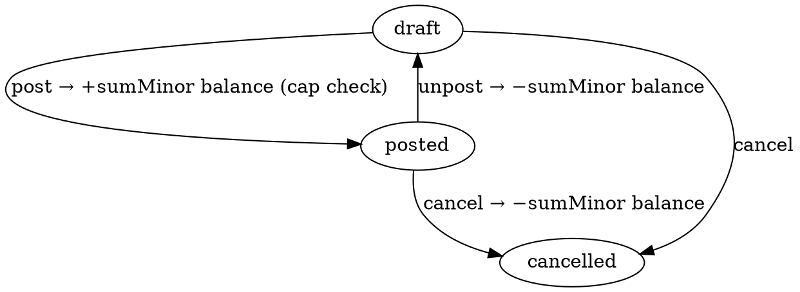

# PrepaymentReturn — Avans qaytarish hujjati

> Mijozga oldin olingan **avansni qaytarish**. Moysklad'ning «Возврат
> предоплаты» hujjatining 1:1 klon implementatsiyasi.

**Status**: ✅ Done · Sprint 9
**Code path**: `apps/api/src/modules/prepayment-return` + `apps/web/src/app/(app)/prepayment-returns`
**DB model**: `PrepaymentReturn` (`packages/db/prisma/schema.prisma:2234`)
**Test count**: 9 unit (service)

---

## 1. Bu nima?

Mijoz sizdan oldin avans qoldirgan edi (`Prepayment` hujjati orqali). Lekin
keyinroq:
- Mijoz buyurtmadan voz kechdi
- Tovar yetkazib bo'lmadi
- Mijoz qabuldan bosh tortdi
- Boshqa biror sabab bilan **pulni qaytarib bermoq** kerak

Aynan shu narsa **«Avans qaytarish»** (PrepaymentReturn).

**Texnik ta'rif**: Prepayment'ning teskari (inverse) operatsiyasi:
- `Prepayment.post` → `−sumMinor` balans (mijoz pul to'ladi, qarzi kamaydi)
- `PrepaymentReturn.post` → `+sumMinor` balans (biz pulni qaytardik, mijozning qarzi qaytib oshadi yoki bizning qarzimiz kamayadi)

**Cap rule**: bitta Prepayment uchun bir nechta PrepaymentReturn bo'lishi mumkin
(qisman qaytarish), lekin **jami qaytarilgan summa hech qachon manba
avansdan ortmasligi shart**. Backend bu qoidani **tranzaksiyada** tekshiradi
— ya'ni 2 ta klerk parallel ravishda ko'p qaytarsa, faqat bittasi o'tadi.

---

## 2. Qachon ishlatamiz?

### Senariy A — Mijoz buyurtmadan voz kechdi

Mijoz 10 ta iPhone uchun 50% avans to'lagan edi (7 500 000 UZS, hujjat
`PR-2026-00001`). 5 kun keyin: *"Endi kerak emas, narxi tushib ketdi"* deydi.

- PrepaymentReturn yarating, `prepaymentId` = `PR-2026-00001`
- Sum = 7 500 000 (to'liq qaytarish)
- Provedeno qilinganda mijozning balansi `+7 500 000` ga o'zgaradi (qarz qaytib paydo bo'ldi)
- Operatsion ravishda: bank/kassa orqali pul mijozga qaytariladi

### Senariy B — Qisman qaytarish

Mijoz avans qoldirgan, lekin tovarning bir qismini olib boshqasini qaytarib bermoqchi.

- Prepayment: 1 000 000 UZS
- PrepaymentReturn #1: 400 000 UZS (mijoz olmagan qismi uchun)
- Keyin: yangi PrepaymentReturn #2 yaratish mumkin, lekin **600 000 UZS dan ko'p emas**
  — backend cap'ni tekshiradi.

### Senariy C — Soliq inspeksiyasi audit izi

Soliq tekshirsa: *"Bu mijozga qaytargansiz, asoslang!"* — siz:
- `PrepaymentReturn` hujjatini ko'rsatasiz
- `prepayment.relation` orqali manba `Prepayment` ga drilldown qilasiz
- `Provedeno sana` (postedAt) bilan vaqt belgilangan
- `externalCode` bilan bank/kassa hujjati bog'langan
- Audit log timeline barcha o'zgarishlarni ko'rsatadi

Bu **toza qog'oz izi**.

### Senariy D — Retail kassadan qaytarish

Magazinda mijoz oldin avans qoldirgan, endi qaytarmoqchi. Kassir POS'da:

- PrepaymentReturn, `retailShiftId` = ochiq smena
- Split: 200 000 naqd qaytarish + 100 000 kartaga qaytarish + 0 QR
- Z-report yopilganda bu qaytarish alohida ko'rsatiladi

---

## 3. Qayerda chiqadi?

### Asosiy joylar

1. **Sub-nav**: `Pul → Avans qaytarish`
   — URL: `/prepayment-returns`

2. **Manba Prepayment karta**: `Pul → Avans → [hujjat]` — bog'liq qaytarishlar ro'yxati

3. **Hisobot**: `Hisobotlar → Kontragentlar balansi` — qaytarish Provedeno bo'lganda darhol balans yangilanadi

### List ko'rinishi (`/prepayment-returns`)

Ustunlar:

| # | Ustun | Misol |
|---|-------|-------|
| 1 | № | PRR-2026-00001 |
| 2 | Sana | 12.05.2026 |
| 3 | Mijoz | ABC MCHJ |
| 4 | Manba avans | PR-2026-00001 → 1 000 000 |
| 5 | Izoh | "Buyurtmadan voz kechildi" |
| 6 | Holat | Provedeno |
| 7 | Summa | **+400 000 UZS** (har doim plus, biz pulni qaytarib berdik) |

### `/new` ko'rinishi

**Majburiy birinchi qadam**: manba `Prepayment` ni tanlash. Picker faqat
`state=posted` avanslarni ko'rsatadi (Qoralama avans hali balansga ta'sir
qilmagan — qaytarish ma'nosi yo'q).

Manba tanlanganda:
- Agent + Organization avtomat to'ldiriladi (manba bilan moslashtirilgan)
- Sum maydoni bo'sh qoladi (klerk to'liq yoki qisman qaytarish summasini kiritadi)
- Retail split (cash/noCash/qr) ixtiyoriy

Klerk Qoldiq tugmasini bossa avansning to'liq summasini avtomat oladi.

### `/[id]` ko'rinishi

- Provedeno qilinganda barcha maydonlar lock bo'ladi
- **Clone yo'q** — har qaytarish noyob, dublikati ma'nosizdir
- Source prepayment'ga link orqali drilldown
- Audit history barcha o'zgarishlarni timeline ko'rsatadi

---

## 4. Holat mashinasi (FSM)



| Tranzitsiya | applyDelta | Belgisi | Cap tekshirish |
|-------------|------------|---------|----------------|
| post | ha | `+sumMinor` | **ha** (transaction ichida) |
| unpost | ha | `−sumMinor` | yo'q |
| cancel from draft | yo'q | — | yo'q |
| cancel from posted | ha | `−sumMinor` | yo'q |

**Cap formulasi**:
```
SUM(posted PrepaymentReturn.sumMinor) ≤ Prepayment.sumMinor
```

Posted qilinishidan oldin tranzaksiyada `assertWithinPrepaymentCap()`
chaqiriladi — agar overshoots bo'lsa `BadRequestException` qaytadi.

---

## 5. Boshqa hujjatlar bilan bog'liqlik

### Prepayment

`prepaymentId` foreign key orqali. `onDelete: Restrict` — manba avans
o'chirilmas, agar uning hech bo'lmasa 1 ta `PrepaymentReturn` mavjud
bo'lsa. (Avansni o'chirishdan oldin qaytarishni avval o'chiring/cancel
qiling.)

### CounterpartyBalance

`+sumMinor` ta'sir, PaymentOut va Prepayment.unpost bilan bir xil belgi.

### RetailShift

Retail qaytarish smena ichida bo'lsa, Z-reportda alohida ko'rsatiladi.

---

## 6. API endpointlar

```
GET    /api/v1/prepayment-returns         # ro'yxat
GET    /api/v1/prepayment-returns/:id     # bitta
POST   /api/v1/prepayment-returns         # yaratish (prepaymentId majburiy)
PATCH  /api/v1/prepayment-returns/:id     # tahrirlash (draft only)
DELETE /api/v1/prepayment-returns/:id     # soft delete
POST   /api/v1/prepayment-returns/:id/transitions/:target  # post|unpost|cancel
```

**Permissions** (`prepaymentreturn`):
- view, create, update, delete, approve

### Yaratish (POST) namunasi

```json
{
  "prepaymentId": "00000000-0000-0000-0002-000000000001",
  "sumMinor": "400000",
  "currency": "UZS",
  "description": "Buyurtmadan voz kechildi",
  "applicable": false
}
```

Backend manba `Prepayment.agentId` va `organizationId` larni avtomat
to'ldiradi (agar caller `agentId/organizationId` yubormagan bo'lsa).

---

## 7. Kelajakda

- [ ] Cap qoldig'ini API javobiga embedded qilish (remainingMinor)
- [ ] Bog'liq hujjatlar grafigi — Prepayment + uning barcha Returnlari
- [ ] Print template — qog'ozli «Расписка о возврате» chiqarish
- [ ] Bank/POS integratsiyasi — qaytarish avtomat bankga signal yuborsin

---

**Tegishli kod**:
- Backend: `apps/api/src/modules/prepayment-return/`
- Frontend: `apps/web/src/app/(app)/prepayment-returns/`
- i18n: `pages.prepayment_return`, `states.prepayment_return`, `nav.money.prepayment_returns`
- Permissions: `apps/api/src/modules/permissions/permissions.types.ts` (`prepaymentreturn`)
- DB model: `packages/db/prisma/schema.prisma:2234`
