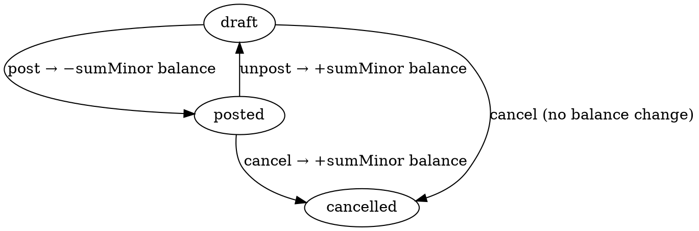

# Prepayment — Avans (Predoplata) hujjati

> Mijozdan **schyot yozilishidan oldin** keladigan oldindan to'lov. Moysklad'ning
> «Предоплата» hujjatining 1:1 klon implementatsiyasi.

**Status**: ✅ Done · Sprint 9
**Code path**: `apps/api/src/modules/prepayment` + `apps/web/src/app/(app)/prepayments`
**DB model**: `Prepayment` (`packages/db/prisma/schema.prisma:2167`)
**Test count**: 11 unit (service)

---

## 1. Bu nima?

Mijoz sizdan tovar yoki xizmat olishni xohlaydi va **oldindan to'lov**
qilishga rozi bo'ldi (yoki shartnoma shuni talab qiladi). Lekin hali
schyot yozilmagan, tovar ham yuk berilmagan. Mijozning bu pulini
**Prepayment** orqali ro'yxatga olamiz:

1. Doc avtomat `PR-YYYY-NNNNN` raqam oladi
2. `Provedeno` qilinganda mijozning balansiga `−sumMinor` ta'sir qiladi
   (qarz kamayadi yoki bizning oldimizdagi liability ortadi)
3. Keyin schyot/yuk berish hujjatlari yozilganda, bu avansni hisobga
   olib qarzdorlikning aniq miqdorini chiqaramiz

**Texnik ta'rif**: Prepayment — `PaymentIn`'ning singlisi, lekin invoice
allocations o'rniga optsiyali `customerOrderId` bog'lanishi bilan keladi.
Hisob-kitob mexanizmi bir xil: `−sumMinor` ni `CounterpartyBalance` ga
qo'shadi (`CounterpartyBalanceService.applyDelta` orqali).

---

## 2. Qachon ishlatamiz?

### Senariy A — Mijoz buyurtmaga avans to'laydi

Mijoz `CustomerOrder` (buyurtma) berdi: 10 ta iPhone, jami 15 000 000 UZS.
Shartnomaga ko'ra 50% oldindan: **7 500 000 UZS avans**.

- Prepayment yarating, `customerOrderId` = buyurtma ID
- Sum = 7 500 000 × 100 = 750 000 000 minor
- Provedeno qilinganda mijozning balansi `−7 500 000` ga o'zgaradi
- Tovar yuk berib bo'lgach, qolgan 50% PaymentIn orqali keladi

### Senariy B — Retail kassada oldindan to'lov

Magazinda mijoz oldindan to'lov qoldirdi (masalan, maxsus buyurtma uchun).
Kassir POS terminalida:

- Prepayment, `retailShiftId` = ochiq smena
- `retailStoreId` = magazin
- Split: 200 000 naqd + 100 000 karta + 0 QR = 300 000 jami
- `taxSystem` = "USN" yoki "OSN" (fiskal printer uchun)

### Senariy C — Yuridik shaxsdan shartnomali avans

B2B mijoz oylik xizmat uchun yil boshida hammasini to'ladi (12 000 000).
Lekin sizning ERP'da xizmat ko'rsatish oylik schyotlar bilan boradi.

- Prepayment: 12 000 000 UZS
- `customerOrderId` = bo'sh (umumiy avans)
- Har oy: yangi InvoiceOut + uni bog'lash uchun ya CashOut/Payment via reallocation

### Senariy D — E-commerce online avans

Mijoz onlayn buyurtma qildi, Click/Payme orqali bu yerda to'ladi. ERP
webhook orqali order keladi:

- `OnlineOrder` create
- Prepayment avtomat (yoki manual) yaratiladi, `applicable=true`
- Bank ekspresida pul kelganda — PaymentIn allocation **emas**, balki
  Prepayment darhol Provedeno qilinadi

---

## 3. Qayerda chiqadi?

### Asosiy joylar

1. **Sub-nav**: `Pul → Avans (Predoplata)`
   — URL: `/prepayments`

2. **Mijoz buyurtmasi karta**: `Savdo → Mijoz buyurtmalari → [buyurtma]` —
   buyurtmaning «Bog'liq hujjatlar» tabida shu buyurtmaga tegishli avanslar

3. **Kontragent karta**: `CRM → Kontragentlar → [Mijoz]` — barcha
   mijozga tegishli avanslar

4. **Hisobot**: `Hisobotlar → Kontragentlar balansi` — Provedeno
   bo'lgan avans **darhol** mijoz balansiga aks etadi

### List ko'rinishi (`/prepayments`)

Ustunlar:

| # | Ustun | Misol |
|---|-------|-------|
| 1 | № | PR-2026-00001 |
| 2 | Sana | 12.05.2026 |
| 3 | Mijoz | ABC MCHJ |
| 4 | Mijoz buyurtmasi | ZP-00045 (yoki —) |
| 5 | Izoh | "Yarmi oldindan" |
| 6 | Holat | Provedeno |
| 7 | Summa | **−7 500 000 UZS** (har doim minus, mijoz pul to'ladi) |

Filter pillalar: All / Qoralama / Provedeno / Bekor qilindi.

### `/new` ko'rinishi

DocumentEditor + DocumentMetaPanel:

Majburiy:
- ⭐ Покупатель (CatalogPicker)
- ⭐ Организация
- ⭐ Сумма (BigInt minor)

Ixtiyoriy:
- Заказ покупателя (mijoz tanlangach picker filterlanadi)
- Валюта (default UZS)
- Naqd / Naqdsiz / QR splittning summasi (yig'indi == sum kerak)
- Retail shift, retail store (chakana smena uchun)
- VAT toggling
- External code
- Comment

### `/[id]` ko'rinishi

Detail/edit, locked when applicable:
- Provedeno qilingach maydonlar disable bo'ladi
- Avval unpost qilinishi kerak — balans avtomat qaytariladi
- Clone (Дублировать) yangi draft yaratadi
- Delete posted bo'lsa balansni qaytarib soft-delete qiladi

Tablar: Сводка / Связанные документы / Файлы / История.

---

## 4. Holat mashinasi (FSM)



| Tranzitsiya | applyDelta | Belgisi |
|-------------|------------|---------|
| post | ha | `−sumMinor` |
| unpost | ha | `+sumMinor` |
| cancel from draft | yo'q | — |
| cancel from posted | ha | `+sumMinor` |
| delete from posted | ha | `+sumMinor` |

---

## 5. Boshqa hujjatlar bilan bog'liqlik

### Counterparty balance

Prepayment posted bo'lganda **darhol** mijoz balansi `−sumMinor` ga
o'zgaradi (PaymentIn bilan bir xil). Hisobot
`/reports/counterparty-balance` darhol bu o'zgarishni ko'rsatadi.

### CustomerOrder

Optsiyali bog'lanish — buyurtma uchun «qancha oldindan to'langan»
hisobotlarda chiqarishga imkon beradi. Buyurtma bekor qilinsa, bog'lanish
`SetNull` orqali tiklanadi (avans yo'qolmaydi, qog'oz iz qoladi).

### RetailShift

Retail kassada qilingan avans `retailShiftId` ga bog'lanadi. Smena
yopilganda Z-report'da bu avans alohida ko'rsatiladi (cashSum, noCashSum,
qrSum komponentlari bilan).

### PrepaymentReturn

Avans qaytarilishi kerak bo'lganda alohida `PrepaymentReturn` hujjati
yoziladi (keyingi sprintda implement qilinadi).

---

## 6. Retail split validatsiyasi

`cashSumMinor + noCashSumMinor + qrSumMinor`:
- Hammasi 0 bo'lsa — wholesale prepayment, validatsiya skip qilinadi
- Birortasi non-zero bo'lsa — uchovining yig'indisi `sumMinor` ga **aniq teng** bo'lishi shart

Bu Zod schema'da `.refine()` orqali enforced. Backend, malicious POST'ni ham bloklaydi.

---

## 7. API endpointlar

```
GET    /api/v1/prepayments         # ro'yxat + filter
GET    /api/v1/prepayments/:id     # bitta
POST   /api/v1/prepayments         # yaratish
PATCH  /api/v1/prepayments/:id     # tahrirlash (draft only)
DELETE /api/v1/prepayments/:id     # soft delete
POST   /api/v1/prepayments/:id/clone
POST   /api/v1/prepayments/:id/transitions/post     # provedeno
POST   /api/v1/prepayments/:id/transitions/unpost   # qaytarish
POST   /api/v1/prepayments/:id/transitions/cancel
```

**Permissions** (`prepayment`):
- view, create, update, delete, approve

### Yaratish (POST) namunasi (wholesale)

```json
{
  "agentId": "00000000-0000-0000-0001-000000000001",
  "organizationId": "00000000-0000-0000-0000-000000000010",
  "customerOrderId": "00000000-0000-0000-0002-000000000001",
  "sumMinor": "750000000",
  "currency": "UZS",
  "vatEnabled": true,
  "description": "50% avans, shartnoma 2026/45",
  "applicable": false
}
```

### Retail variant

```json
{
  "agentId": "...",
  "organizationId": "...",
  "retailShiftId": "...",
  "retailStoreId": "...",
  "sumMinor": "300000",
  "cashSumMinor": "200000",
  "noCashSumMinor": "100000",
  "qrSumMinor": "0",
  "taxSystem": "USN",
  "applicable": true
}
```

---

## 8. Kelajakda

- [ ] PrepaymentReturn — avans qaytarish hujjati
- [ ] CustomerOrder.payedSumMinor auto-update — buyurtma karta'da to'lov foizini ko'rsatish uchun
- [ ] Auto-prepayment from online checkout — webhook + PaymentGateway integratsiya
- [ ] EDO/fiskal pechat — retail prepayment uchun
- [ ] Pre-write-off matching — avans qarzdan ortib qolsa, kelgusi schyotlarga auto-allocate

---

**Tegishli kod**:
- Backend: `apps/api/src/modules/prepayment/`
- Frontend: `apps/web/src/app/(app)/prepayments/`
- i18n: `pages.prepayment`, `states.prepayment`, `nav.money.prepayments`
- Permissions: `apps/api/src/modules/permissions/permissions.types.ts` (`prepayment`)
- DB model: `packages/db/prisma/schema.prisma:2167`
