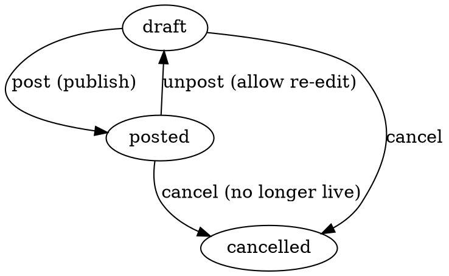

# PriceList — Narx ro'yxati

> Bir vaqtning o'zida narxlar snapshot'i (frozen catalogue). Moysklad'ning
> «Прайс-лист» hujjatining 1:1 klon implementatsiyasi.

**Status**: ✅ Done · Sprint 9
**Code path**: `apps/api/src/modules/price-list` + `apps/web/src/app/(app)/price-lists`
**DB model**: `PriceList` (`packages/db/prisma/schema.prisma:2436`)
**Test count**: 8 unit (service)

---

## 1. Bu nima?

`PriceType` (Narx turi) — bu **toifa** (kategoriya): "Wholesale", "VIP",
"Retail". Bu mahsulotda **doimo joriy** narxni belgilaydi va siz mahsulot
narxini o'zgartirganda u darhol yangilanadi.

`PriceList` (Narx ro'yxati) — bu **frizing qilingan snapshot**: aniq
sanada barcha mahsulotlarning narxlarini bir hujjatda saqlash. Masalan,
"Sales prices 2026-Q2 v3" — bu vaqtdagi snapshot.

**Texnik shakl**: `pricesJson` ustuni JSONb tipida quyidagi shaklda
saqlanadi:

```json
{
  "<productId>": {
    "<priceTypeId>": "<minor amount as string>",
    "<priceTypeId>": "<minor amount as string>"
  },
  ...
}
```

Misol:
```json
{
  "11111111-...": {
    "wholesale-uuid": "1200000000",   // 12 000 000 UZS
    "retail-uuid":   "1500000000"     // 15 000 000 UZS
  }
}
```

---

## 2. Qachon ishlatamiz?

### Senariy A — Sezonal narxlar

Yangi Yil oldidan promo narxlar qo'llanilishi kerak. Lekin Yangi Yil
o'tib ketgach, eski narxlar qaytishi kerak. Va auditor: "Promo davrida
qaysi narxda sotgansiz?" deb so'rasa, javobni topa olishingiz kerak.

- "NY Promo 2026" PriceList yarating
- 1-yanvardan boshlab Provedeno qiling
- 2-fevralda Provedeno emas qiling (yana eski narxlar ishlatiladi)
- Tarix qoladi → audit ko'rsata olasiz

### Senariy B — Kontrakt narxlari

VIP mijoz bilan shartnoma tuzdingiz: maxsus narx bilan butun yil
ta'minlaysiz. Shu narxlarni alohida PriceList'da fiksirovat qilasiz:

- "VIP 2026 — ABC MCHJ" PriceList
- Faqat shartnoma mahsulotlari
- Mijoz "narxlar oshib ketsa-chi?" deydi — siz: "Yo'q, snapshot frizing qilingan"

### Senariy C — Eksport uchun

Tashqi tizim (1C, partner kompaniya, marketplace) uchun narxlar dump kerak:

- PriceList yarating
- `code = "MARKETPLACE_2026Q2"` qo'ying
- `externalCode` orqali partner tizim bilan sinxronizatsiya qilinadi
- Export endpoint orqali ushbu PriceList o'qib JSON/CSV chiqaradi

### Senariy D — Soliq inspeksiyasi auditi

Soliqlash audit qildi: "Bu mijozga 2026-yil mart oyida qancha narxda
sotgansiz?" — Siz:

- `/price-lists` ro'yxatdan o'sha vaqtdagi `applicable=true` ro'yxatni topasiz
- pricesJson'da mahsulot narxini ko'rsatasiz
- Bu **frizing qilingan** snapshot — keyin o'zgartirilmagan

---

## 3. Qayerda chiqadi?

### Asosiy joylar

1. **Sub-nav**: `Tovarlar → Narx ro'yxatlari`
   — URL: `/price-lists` (Narx turlari'dan keyin)

2. **Mahsulot karta**: Mahsulot o'zining "current" narxiga ega (PriceType
   orqali), lekin keyingi sprintlarda har mahsulot uchun "qaysi
   PriceList'larda ishtirok etgan" tab qo'shilishi mumkin.

3. **Hisobotlar**: Sales hisobotlarida har sotuv qaysi PriceList'dan
   narx olganini ko'rsatish mumkin (kelajakda).

### List ko'rinishi

| # | Ustun | Misol |
|---|-------|-------|
| 1 | Nom | Sales prices 2026-Q2 |
| 2 | Sana | 01.04.2026 |
| 3 | Tashkilot | MCHJ Demo |
| 4 | Default narx turi | Wholesale |
| 5 | Mahsulotlar soni | 245 |
| 6 | Holat | Provedeno |

### `/new` ko'rinishi

Standart DocumentEditor + DocumentMetaPanel + **PriceMatrixEditor**
custom komponent:

- Yuqorida: Nom, Tashkilot, Default narx turi, Izoh
- Pastida: matritsa (jadval) — qator = mahsulot, ustun = narx turi
- Har hujayraga BigInt minor narx kiritiladi
- "+ Mahsulot" tugmasi: yangi qator (CatalogPicker bilan mahsulot tanlash)
- "+ Narx turi" tugmasi: yangi ustun (PriceType picker)

### `/[id]` ko'rinishi

- Provedeno qilingach lock bo'ladi (snapshot frozen)
- Unpost qilinsa qaytadan tahrirlash mumkin
- Clone — yangi PriceList yaratadi (nom oxirida " (copy)")
- Soft delete — agar kerak emas bo'lsa

---

## 4. Holat mashinasi (FSM)



| Tranzitsiya | Ta'sir |
|-------------|--------|
| post | snapshot frozen, exporterlar bu listni "live" hisoblaydi |
| unpost | qaytadan tahrirlash mumkin, exporterlar bu listni ko'rmaydi |
| cancel | hujjat audit jurnalida qoladi, lekin "live" emas |

**Stock yoki balans ta'siri YO'Q** — bu publication artefact, hisob-kitob hujjati emas.

---

## 5. PriceMatrixEditor — UX

Klerk ko'radigan shakl:

```
+----+------+----+------+------+------+----+
| #  | Tovar         | Wholesale | Retail | VIP | x |
+----+------+----+------+------+------+----+
| 1  | iPhone 15 Pro | 12 000    | 15 000 | 14 000 | × |
| 2  | Galaxy S24     | 10 000    | 13 000 | 12 500 | × |
| 3  | + Mahsulot                                        |
+----+------+----+------+------+------+----+
                                            [+ Narx turi]
```

Matritsa avtomat to'liq bo'lib boradi:
- Yangi qator: barcha mavjud ustunlar uchun `'0'` boshlanadi
- Yangi ustun: barcha mavjud qatorlar uchun `'0'` boshlanadi
- Bo'sh hujayra → API javobida bu (productId, priceTypeId) jufti bo'lmaydi (zero suppressed)

---

## 6. API endpointlar

```
GET    /api/v1/price-lists         # ro'yxat
GET    /api/v1/price-lists/:id     # bitta
POST   /api/v1/price-lists         # yaratish
PATCH  /api/v1/price-lists/:id     # tahrirlash (draft only)
DELETE /api/v1/price-lists/:id     # soft delete
POST   /api/v1/price-lists/:id/clone
POST   /api/v1/price-lists/:id/transitions/:target  # post|unpost|cancel
```

**Permissions** (`pricelist`):
- view, create, update, delete, approve

### Yaratish (POST) namunasi

```json
{
  "name": "Sales prices 2026-Q2",
  "organizationId": "00000000-0000-0000-0000-000000000010",
  "priceTypeId": null,
  "currency": "UZS",
  "description": "Q2 2026 sezonal narxlar",
  "applicable": false,
  "pricesJson": {
    "11111111-1111-1111-1111-111111111111": {
      "22222222-2222-2222-2222-222222222222": "1200000000",
      "33333333-3333-3333-3333-333333333333": "1500000000"
    }
  }
}
```

---

## 7. Kelajakda

- [ ] Excel import — katta katalog uchun CSV/XLSX yuklash
- [ ] Excel export — frizing qilingan PriceList ni mijozga yuborish uchun
- [ ] Webhook — yangi PriceList posted bo'lsa partner tizimlarni xabardor qilish
- [ ] Diff view — ikkita PriceList o'rtasidagi narx farqi vizualizatsiyasi
- [ ] Bulk operations — bir nechta mahsulotning narxini bir vaqtda o'zgartirish
- [ ] Print template — qog'oz nashri uchun

---

**Tegishli kod**:
- Backend: `apps/api/src/modules/price-list/`
- Frontend: `apps/web/src/app/(app)/price-lists/`
- i18n: `pages.price_list`, `states.price_list`, `nav.products.price_lists`
- Permissions: `apps/api/src/modules/permissions/permissions.types.ts` (`pricelist`)
- DB model: `packages/db/prisma/schema.prisma:2436`
