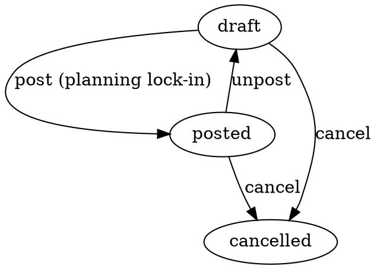

# ProcessingOrder — Qayta ishlash buyurtmasi

> Ishlab chiqarish planlash hujjati: "biz X ta mahsulot Y'ni Z BOM
> retsepti bo'yicha ishlab chiqarmoqchimiz". Moysklad'ning «Заказ на
> переработку» hujjatining 1:1 klon implementatsiyasi.

**Status**: ✅ Done · Sprint 9
**Code path**: `apps/api/src/modules/processing-order` + `apps/web/src/app/(app)/processing-orders`
**DB model**: `ProcessingOrder` (`packages/db/prisma/schema.prisma:2945`)
**Test count**: 10 unit (service)

---

## 1. Bu nima?

Moysklad'da production workflow uchun 3 ta hujjat tipi bor:

1. **BillOfMaterials** (BOM) — retsept: "1 ta itmek tayyorlash uchun: 200 g un + 50 g shakar + ..."
2. **ProcessingOrder** — planning: "biz 100 ta itmek ishlab chiqarmoqchimiz, BOM#1 retsept bo'yicha"  ⬅ **bu modul**
3. **Processing** — real shop-floor execution: "bugun 25 ta itmek tayyorladik, materiallar ombordan yozildi, mahsulot omborga qo'shildi"

ProcessingOrder **stock'ga ta'sir qilmaydi** — bu planning artefact. Real stock o'zgarishi `Processing` operatsiyasi orqali bo'ladi (keyingi sprintda implement qilinadi).

---

## 2. Qachon ishlatamiz?

### Senariy A — Konditer (cake bakery)

BOM#1: "Chocolate cake" = 200 g flour + 100 g cocoa + 4 ta tuxum + 50 g sugar + ... (10 ta ingredient)

Buyurtmachi 500 ta tort buyurtma berdi. Konditer:
- ProcessingOrder yaratadi
- `processingPlanId` = BOM#1
- `quantity` = 500
- `deliveryPlannedMoment` = 10 kun keyin
- `storeId` = Konditerlik bo'limi ombori
- "Materiallar (BOM dan)" tabida tizim avtomat ko'rsatadi: 100 kg flour + 50 kg cocoa + 2000 ta tuxum + ...

Bu pre-purchase planning'ga yordam beradi: yetarli materiallar bor yoki yo'qligini ko'rasiz.

### Senariy B — Furniture assembly

BOM#5: "Office chair" = 1 ta plastic seat + 1 ta metal frame + 4 ta wheel + 1 box screws

Korxona 50 ta stulni ishlab chiqarmoqchi:
- ProcessingOrder quantity=50
- standardCostMinor × 50 = 32 500 000 UZS (BOM dan avtomat)
- Provedeno qilinganda buyurtma "rejaga" o'tadi
- Hot keyingi kunlarda Processing operations ochiladi:
  - 1-kun: 15 ta stul yig'ildi
  - 2-kun: 20 ta stul yig'ildi
  - 3-kun: 15 ta stul yig'ildi (jami 50)

### Senariy C — Multi-stage production

Production batch ostida bir nechta ProcessingOrder bo'lishi mumkin:
- Production "Q2 2026 bakery batch"
  - ProcessingOrder #1: 500 ta tort
  - ProcessingOrder #2: 200 ta keks
  - ProcessingOrder #3: 1000 ta pechen'e

`productionId` field bularni bir-biriga bog'laydi.

---

## 3. Qayerda chiqadi?

### Asosiy joylar

1. **Sub-nav**: `Ishlab chiqarish (Production) → Qayta ishlash`
   — URL: `/processing-orders`

2. **BOM karta**: kelajakda `/boms/[id]` sahifasida bu BOM'ni ishlatuvchi
   ProcessingOrder'lar ro'yxati chiqishi mumkin

3. **Production batch karta**: agar `productionId` bo'lsa, parent batch sahifasida ko'rsatilishi mumkin

### List ko'rinishi

| # | Ustun | Misol |
|---|-------|-------|
| 1 | № | PO-2026-00001 |
| 2 | Sana | 12.05.2026 |
| 3 | Yetkazib berish sanasi | 22.05.2026 |
| 4 | Maqsad ombor | Konditerlik bo'limi |
| 5 | BOM nomi | Chocolate cake |
| 6 | Output mahsulot | Chocolate cake |
| 7 | Miqdor | 500 |
| 8 | Holat | Provedeno |
| 9 | Summa | 32 500 000 UZS (standard cost) |

### `/new` ko'rinishi

- Organization + Maqsad ombor + BOM picker + Yetkazib berish sanasi
- Miqdor input (whole units; kod ×1000 multiplies to BigInt)
- BOM tanlanganda materiallar table avtomat to'ladi:

```
+----+----------------+--------+---------+-------------+
| #  | Komponent       | Birlik | Per unit | Jami kerak  |
+----+----------------+--------+---------+-------------+
| 1  | Un              | g      |  200     | 100 000 g   |
| 2  | Kakao           | g      |  100     |  50 000 g   |
| 3  | Tuxum           | dona   |    4     |   2 000 dona |
| ...                                                  |
+----+----------------+--------+---------+-------------+
                                  Jami: 32 500 000 UZS
```

Bu **live** — quantity o'zgartirilganda darhol qayta hisoblanadi.

### `/[id]` ko'rinishi

- Provedeno qilinganda barcha maydonlar lock
- BOM info read-only kartochka ko'rinishida ko'rsatiladi
- Clone tugmasi: yangi ProcessingOrder yaratadi (BOM + quantity bilan)
- Soft delete: posted bo'lsa, avval unpost qilish kerak

---

## 4. Holat mashinasi (FSM)



**Hech qanday stock yoki balance ta'sir yo'q** — bu pure planning doc.

Real stock impact `Processing` operatsiyasi orqali:
- Processing.post → consume materials from materialsStoreId
- Processing.post → produce output product into productsStoreId
- Cost basis: BOM.standardCostMinor → output Product.costMinor (FIFO)

(Processing moduli keyingi sprintda implement qilinadi — TODO marker'i `processing-order.service.ts` ichida transition() funksiyasi yonida.)

---

## 5. Boshqa hujjatlar bilan bog'liqlik

### BillOfMaterials (BOM)

Required when `processingPlanId` is set. Service findById include qiladi:
- BOM.name, BOM.outputQty, BOM.standardCostMinor
- BOM.components — har biri (product, qty)

UI live calculation: `componentQty × order.quantity / BOM.outputQty = total needed`.

Misol: BOM yields 10 cakes per run, order is 500 cakes → multiplier = 50.

### Production (batch parent)

Optional `productionId` — yuqori darajadagi batch grouping.

### Processing (operation execution)

Keyingi sprintda implement qilinadi. Har Processing `processingOrderId` orqali bog'lanadi.

---

## 6. API endpointlar

```
GET    /api/v1/processing-orders         # ro'yxat
GET    /api/v1/processing-orders/:id     # bitta, BOM + components bilan
POST   /api/v1/processing-orders         # yaratish
PATCH  /api/v1/processing-orders/:id     # tahrirlash (draft only)
DELETE /api/v1/processing-orders/:id     # soft delete
POST   /api/v1/processing-orders/:id/clone
POST   /api/v1/processing-orders/:id/transitions/:target  # post|unpost|cancel
```

**Permissions** (`processingorder`):
- view, create, update, delete, approve

### Yaratish (POST) namunasi

```json
{
  "organizationId": "00000000-0000-0000-0000-000000000010",
  "storeId": "00000000-0000-0000-0000-000000000020",
  "processingPlanId": "00000000-0000-0000-0000-000000000060",
  "quantity": "500000",
  "deliveryPlannedMoment": "2026-05-22",
  "description": "Q2 cake batch — buyurtmachi: XYZ",
  "applicable": false
}
```

Backend BOM'dan `sumMinor = standardCostMinor × (quantity / 1000)` ni avtomat hisoblaydi.

---

## 7. Kelajakda

- [ ] **Processing** moduli — actual shop-floor execution + stock cascade
- [ ] **Material availability check** — yaratganingda yetarli stock bormi yo'qmi
- [ ] Auto-create purchase order — material yetishmasa, suppliers'ga avtomat zakaz
- [ ] Production schedule diagram — Gantt-style timeline har ProcessingOrder uchun
- [ ] Multi-BOM support — bitta ProcessingOrder bir necha BOM'dan
- [ ] Yield variance tracking — actual production vs. planned

---

**Tegishli kod**:
- Backend: `apps/api/src/modules/processing-order/`
- Frontend: `apps/web/src/app/(app)/processing-orders/`
- i18n: `pages.processing_order`, `states.processing_order`, `nav.production.processing_orders`
- Permissions: `apps/api/src/modules/permissions/permissions.types.ts` (`processingorder`)
- DB model: `packages/db/prisma/schema.prisma:2945`
