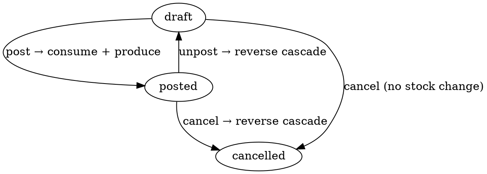

# Processing — Texoperatsiya (shop-floor execution)

> **Real stock cascade** qiluvchi ishlab chiqarish operatsiyasi. Materiallar
> ombordan yoziladi, output mahsulot omborga keladi — bir tranzaksiyada.
> Moysklad'ning «Техоперация» hujjatining 1:1 klon implementatsiyasi.

**Status**: ✅ Done · Sprint 9
**Code path**: `apps/api/src/modules/processing` + `apps/web/src/app/(app)/processings`
**DB model**: `Processing` (`packages/db/prisma/schema.prisma:3001`)
**Test count**: 18 unit (service, including adversarial QA cases)

---

## 1. Bu nima va nima farqi?

Production trilogiyasidagi 3-darajali hujjat:

| Hujjat | Maqsad | Stock ta'siri |
|--------|--------|---------------|
| **BillOfMaterials** | Retsept ("1 ta tort = 200g un + 50g shakar + ...") | yo'q |
| **ProcessingOrder** | Planning ("biz 500 ta tort ishlab chiqarmoqchimiz") | yo'q |
| **Processing** ⬅ **bu modul** | Execution ("bugun 100 ta tort tayyorladik") | ✅ HA |

Aynan **Processing** post qilinganda:
1. Materiallar `materialsStoreId` ombordan **−delta** bo'lib yoziladi
2. Output mahsulot `productsStoreId` omborga **+delta** bo'lib keladi
3. Hammasi **Serializable** tranzaksiya ichida (race-safe)
4. Material yetishmasa — `BadRequestException` bilan shortage info qaytadi

---

## 2. Qachon ishlatamiz?

### Senariy A — Konditer sex

BOM#1: "Chocolate cake" = 200 g un + 100 g kakao + 4 ta tuxum
ProcessingOrder #12 (planning): 500 ta tort

Konditer **kun davomida** bir nechta partiya yasadi:
- 09:00 — Processing #1: 100 ta tort (3 soat ishladi)
- 14:00 — Processing #2: 150 ta tort
- 17:00 — Processing #3: 250 ta tort

Har Processing post qilinganda:
- 100 × (200g/1) = 20 kg un → −20 kg sex ombori
- 100 × (100g/1) = 10 kg kakao → −10 kg sex ombori
- 100 × 4 = 400 ta tuxum → −400 ta sex ombori
- 100 ta tort → **+100 ta** tayyor mahsulot ombori
- costSumMinor = BOM.standardCost × 100 (output product'ning cost basis'i)

Hammasi **bir transaction** — agar bir material yetishmasa, hech narsa o'zgarmaydi (atomicity).

### Senariy B — Multi-stage production

BOM#5: "Yashil choy paket" = 50 g choy + 1 ta paket + 1 ta yorliq
BOM#6: "Kassa karton" = 12 ta paket + 1 ta karton

Klerk 2 ta Processing yaratadi:
- Processing #1 (BOM#5, qty=120) — 120 ta paket tayyor → mahsulot ombori
- Processing #2 (BOM#6, qty=10) — 120 paket kartonlangan → tayyor mahsulot ombori (kartonlar = output)

Bu yerda Processing #2 ning materiallari = Processing #1 ning outputlari. Tizim hammasini avtomat to'g'ri hisoblaydi (cost cascade).

### Senariy C — Inventory accident reversal

Klerk Processing#7 post qildi, lekin keyin xato bo'lganini sezdi:
- POSTED hujjatda **Edit blocked** (server gard)
- Bekor qilish tugmasini bosadi → **cancel** transition
- Tizim deltani teskari yo'naltiradi:
  - Materiallar omborga qaytariladi (+qty)
  - Output mahsulot yo'qoladi (−qty)
- costSumMinor saqlanib qoladi (audit izi)

### Senariy D — Audit / soliq inspeksiya

Hisobotchi: "Bu mahsulotning cost basis qayerdan?"

Processing.costSumMinor = `BOM.standardCostMinor × (quantity / BOM.outputQty)`.
StockOperation jadvalida har bir consume/produce qator yozilgan:
- `processing_consume` — qaysi materialdan yozildi
- `processing_produce` — output qachon qaysi omborga keldi
- `processing_unpost_*` / `processing_cancel_*` — agar qaytarildi

To'liq audit trail bor.

---

## 3. Qayerda chiqadi?

### Asosiy joylar

1. **Sub-nav**: `Ishlab chiqarish → Texoperatsiyalar` (Qayta ishlash tabidan keyin)
   — URL: `/processings`

2. **ProcessingOrder /[id] sahifasi**: kelajakda "Yaratish → Processing operatsiyasi" tugma qo'shilishi mumkin

3. **Stock balance hisoboti**: post qilingach materiallar va output stockda darhol ko'rinadi

### List ko'rinishi

| # | Ustun | Misol |
|---|-------|-------|
| 1 | № | TP-2026-00001 |
| 2 | Sana | 12.05.2026 |
| 3 | Materiallar ombor | Sex ombori |
| 4 | Output ombor | Tayyor mahsulot ombori |
| 5 | BOM | Chocolate cake |
| 6 | Output mahsulot | Chocolate cake |
| 7 | Output miqdor | 100 |
| 8 | Holat | Provedeno |
| 9 | Cost summa | 50 000 000 UZS |

### `/new` ko'rinishi

- Organization picker (default = birinchi tashkilot)
- **BOM picker** — REQUIRED (server reject qiladi BOM siz)
- **Materiallar ombor** + **Output ombor** — alohida ikki picker
- Output miqdor input (whole units; server ×1000 mikro)
- Manba ProcessingOrder picker (ixtiyoriy) — agar tanlasangiz BOM avtomat ko'chiriladi
- "Materiallar (BOM dan)" live jadval:
  - component × (quantity / outputQty) = total needed
  - cost basis preview

### `/[id]` ko'rinishi

- Provedeno qilingach barcha maydonlar **disabled**
- Cancel tugmasi → reversal cascade
- **"Stock ta'siri" karta** (faqat posted bo'lsa):
  - ↓ Materiallar ombor — yozildi
  - ↑ Output ombor — keldi
- Clone tugma → yangi draft
- Soft delete faqat draft (must unpost first if posted)

---

## 4. Holat mashinasi (FSM)



**Stock ta'siri**:

| Tranzitsiya | Materiallar | Output | costSumMinor |
|-------------|-------------|--------|--------------|
| `post` | −qty (consume) | +qty (produce) | set from BOM × ratio |
| `unpost` | +qty (restore) | −qty (remove) | reset to 0 |
| `cancel` from draft | — | — | — |
| `cancel` from posted | +qty (restore) | −qty (remove) | kept for audit |
| `delete` from posted | (blocked — unpost first) | — | — |

**Race-safety**:
- `isolationLevel: 'Serializable'` $transaction
- `lockBalances` row-level locks ordered by assortmentId
- State re-read inside tx (`fresh.state === 'draft'`) prevents double-post

---

## 5. BOM materiallar formulasi

```
recipeRuns = processing.quantity (whole units) / BOM.outputQty
materialQty = bomComponent.qty × recipeRuns
outputCost  = BOM.standardCostMinor × recipeRuns
```

Misol:
- BOM yields 5 ta tort/run, standardCost = 100 000 minor/run
- Processing.quantity = 20 ta tort → recipeRuns = 4
- Material A (komponent qty=2): 2 × 4 = 8 ta
- Output cost: 100 000 × 4 = 400 000 minor

---

## 6. API endpointlar

```
GET    /api/v1/processings         # ro'yxat
GET    /api/v1/processings/:id     # bitta, BOM komponentlari bilan
POST   /api/v1/processings         # yaratish (BOM majburiy)
PATCH  /api/v1/processings/:id     # tahrirlash (draft only)
DELETE /api/v1/processings/:id     # soft delete (draft only)
POST   /api/v1/processings/:id/clone
POST   /api/v1/processings/:id/transitions/:target  # post|unpost|cancel
```

**Permissions** (`processing`):
- view, create, update, delete, approve

### Yaratish (POST) namunasi

```json
{
  "organizationId": "00000000-0000-0000-0000-000000000010",
  "materialsStoreId": "00000000-0000-0000-0000-000000000020",
  "productsStoreId": "00000000-0000-0000-0000-000000000021",
  "processingPlanId": "00000000-0000-0000-0000-000000000050",
  "processingOrderId": "00000000-0000-0000-0000-000000000060",
  "quantity": "20",
  "moment": "2026-05-12T10:00:00",
  "applicable": false,
  "description": "Q2 sex partiyasi #3"
}
```

### Stock yetishmasligi xato namunasi

POST `/processings/:id/transitions/post` agar material yetishmasa:

```json
{
  "statusCode": 400,
  "error": "InsufficientStock",
  "message": "Omborda yetarli miqdor yo'q",
  "details": {
    "shortages": [
      {
        "assortmentKind": "product",
        "assortmentId": "...",
        "name": "Un",
        "requested": "20",
        "available": "5",
        "shortage": "15"
      }
    ]
  }
}
```

Klerk: avval material kirim qilish kerak (Enter / Supply hujjati), keyin qaytadan post.

---

## 7. Cost cascade — chuqurroq

Output mahsulotning real cost basis'i (BOM standartdan emas, real
Stock'dan) shu zanjir orqali keladi:

```
Material A stock:  qty=100, costBalanceMinor=1 000 000  → per-unit = 10 000
                   consume 20 → 20 × 10 000 = 200 000 minor cost out

Material B stock:  qty=50,  costBalanceMinor=100 000    → per-unit = 2 000
                   consume 5 → 5 × 2 000 = 10 000 minor cost out

Output product:    +qty=10, +costBalance=210 000 (= 200 000 + 10 000)
                   per-unit cost basis on output = 21 000
```

Material yetishmasligi *yoki* cost basis'siz (legacy Stock) materiallar
uchun output'ning cost basis 0 ga teng bo'ladi — bu **yo'q ma'lumotni
yaratmaslik** prinsipi. Soliq inspeksiya: "qaerdan cost?" so'rasa, real
materiallar zanjiri ko'rsatiladi.

### Snapshot

Post vaqtida `Processing.materialsSnapshot` JSONb maydonida yoziladi:

```json
{
  "outputProductId": "...",
  "outputQty": "10",
  "items": [
    { "productId": "...A", "qty": "20", "costMinor": "200000" },
    { "productId": "...B", "qty": "5",  "costMinor": "10000" }
  ]
}
```

Unpost / cancel **shu snapshot'ni** ishlatadi — BOM tahrirlangan
bo'lsa ham, Stock'da boshqa o'zgarishlar bo'lsa ham, deltalar **aniq
teskari** yo'naltiriladi.

### Fulfilment counter

`ProcessingOrder.movedSumMinor` har Processing.post da +outputCost,
unpost/cancel da -outputCost. ProcessingOrder /[id] sahifasida progress
bar ko'rinadi: planned vs done vs remaining.

---

## 8. Test coverage

18 unit test (adversarial QA):

- ✅ Sign — materiallar negative, output positive
- ✅ Math — BOM yields > 1 per run multiplier
- ✅ Sufficiency — insufficient stock rejected
- ✅ State guards — post rejected on non-draft, unpost on non-posted, cancel on already cancelled
- ✅ No BOM — fast-fail without processingPlanId
- ✅ Zero outputQty — division-by-zero guard
- ✅ Reversal — unpost emits exact-opposite deltas + zeroes costSumMinor
- ✅ Cancel from draft — skips stock reversal
- ✅ Cancel from posted — reverses + keeps costSumMinor for audit
- ✅ Update + delete guards — blocked on posted state
- ✅ Soft-deleted exclusion — findById returns NotFound for deleted rows

---

**Tegishli kod**:
- Backend: `apps/api/src/modules/processing/`
- Frontend: `apps/web/src/app/(app)/processings/`
- i18n: `pages.processing`, `states.processing`, `nav.production.processings`
- Permissions: `apps/api/src/modules/permissions/permissions.types.ts` (`processing`)
- DB model: `packages/db/prisma/schema.prisma:3001`
- Related: ProcessingOrder (planning), BillOfMaterials (recipe), StockService (cascade)
